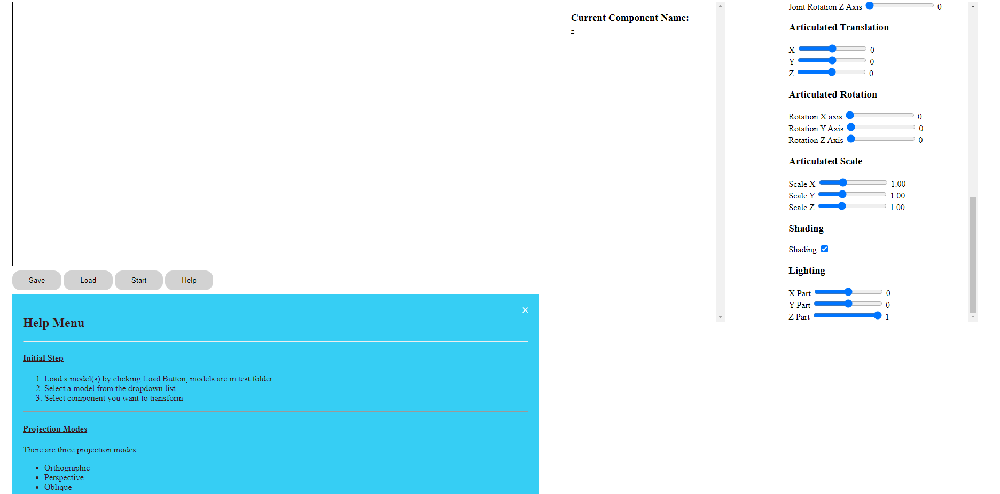
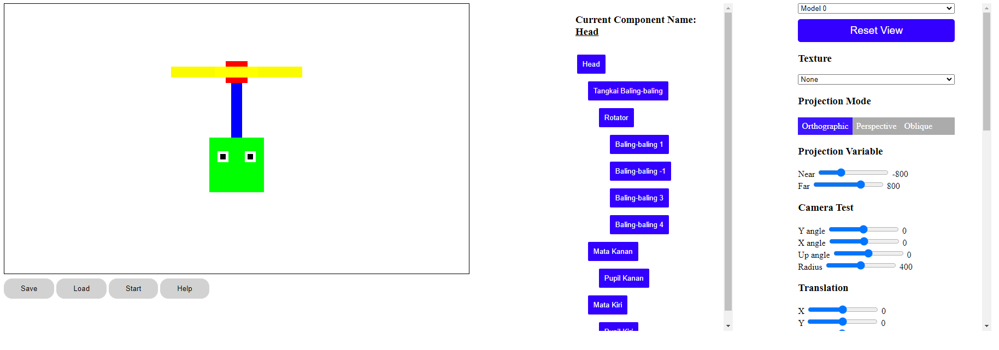
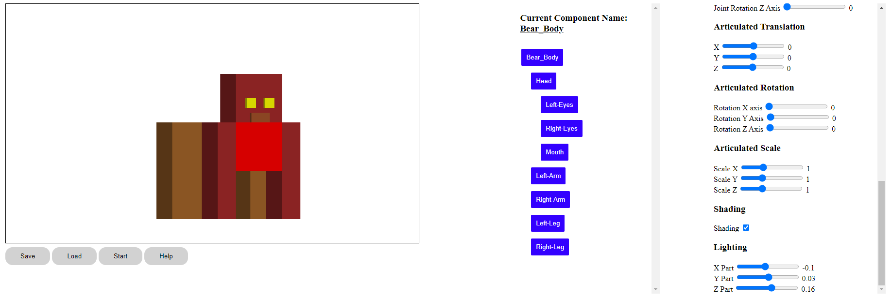
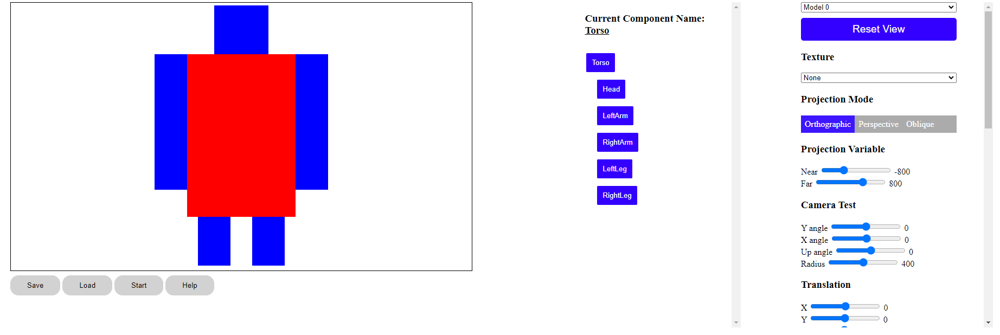
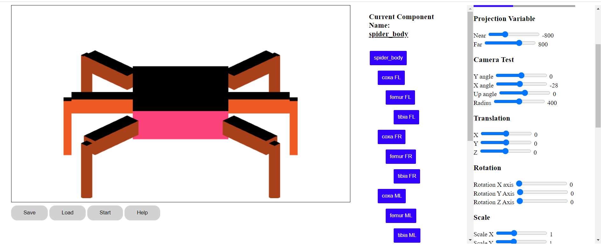

# IF3260_Tugas3_K01_G15 Articulated Model
Tugas ini disusun untuk memenuhi tugas mata kuliah IF3260 Grafika Komputer tahun ajaran 2022/2023

# Cara Menjalankan Program
1. Melakukan **git clone** pada _repository_ ini.
- Untuk pengguna _windows_
```
git clone https://github.com/reynull20/IF3260_Tugas3_K01_G15
```
- Untuk pengguna _linux_
```
git clone git@github.com:reynull20/IF3260_Tugas3_K01_G15.git
```
2. Membuka _folder_ hasil _repository_ yang telah di-_clone_
3. Membuka _folder_ **src**
4. Membuka _file_ **index.html**
5. Program berhasil dijalankan
6. Load objek dengan cara klik Load Button
7. Pilih satu atau lebih objek pada _folder_ **test**
8. Gambar tertampilkan pada canvas
9. Pilih komponen dari objek yang sudah di-load, dan dapat ditransformasikan, pemberian shading, serta mengubah jenis proyeksi.
10. Keterangan opsi setiap aktivitas yang dapat dilakukan dapat dilihat pada Help Pane Aplikasi.

# Tampilan Aplikasi
- Tampilan



# Model Articulated Model
- Baling-baling (NobiXX)



- Bear (Beruang)



- Steve (Humanoid)



- Laba-laba (Arachnoid)



# Authors
- Nomor Kelompok: 15
- Kelas: K01

|NIM|Nama|
|---|---|
|13519045|M Reyhanullah Budiaman|
|13520009|Ahmad Romy Zahran|
|13520020|William Manuel Kurniawan|
|13520040|Ng Kyle|